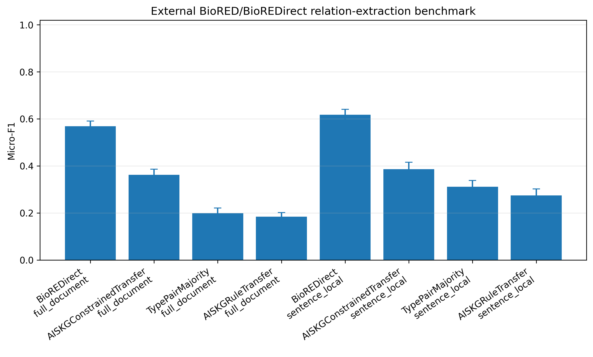

# AISKG

**Ontology-constrained evidence extraction for provenance-aware biomedical knowledge graphs**

[](https://github.com/romenmeitei/AISKG/actions/workflows/ci.yml)
[](VERSION)
[](pyproject.toml)
[](LICENSE)
[](CITATION.cff)

AISKG is a biomedical literature-mining and knowledge-engineering framework for constructing **typed, directed and provenance-linked evidence graphs**. It combines semantic corpus organization, canonical entity normalization, ontology-constrained relation evidence, outcome-aware graph reasoning, pathway reconstruction, blinded expert review and deterministic release verification.

The repository accompanies the manuscript **“AISKG: ontology-constrained evidence extraction for provenance-aware biomedical knowledge graphs.”** Mushroom toxicology is used as the medical case study; an independent BioRED/BioREDirect experiment evaluates whether AISKG-derived relation modelling transfers beyond that domain.

> **Intended use.** AISKG supports literature curation, evidence navigation, mechanistic hypothesis formulation and expert review. It is not a diagnostic system, a treatment recommender or a substitute for clinical or toxicological judgment.

## Release lineage

The version numbers identify distinct reproducibility layers rather than competing implementations.

| Version | Role in the repository |
|---|---|
| **v3.2.0** | Current repository version. Adds the independent BioRED/BioREDirect relation-classification benchmark, transfer adapters, public-safe frozen outputs and release verification. |
| **v3.1.2** | Frozen reviewer-level and in-domain benchmark replay used for the manuscript’s blinded validation and corrected PubTator/Qwen comparison. |
| **v3.0.0** | Deterministic analytical core for corpus processing, semantic modelling, graph construction, pathway analysis, ablation and 285 expected-result assertions. |

For editorial and peer review, v3.2.0 is the complete public-facing repository version; it retains the frozen v3.1.2 reviewer/in-domain replay and the v3.0.0 analytical core unchanged. The release history is documented in [CHANGELOG.md](CHANGELOG.md), [RELEASE_NOTES_v3.2.0.md](RELEASE_NOTES_v3.2.0.md) and [RELEASE_VALIDATION_REPORT.md](RELEASE_VALIDATION_REPORT.md).

## Methodological scope

AISKG separates evidence extraction from downstream interpretation.

1. **Corpus construction and semantic organization** — metadata harmonization, deduplication, sentence segmentation, transformer embeddings and BERTopic-assisted topic organization.
2. **Evidence extraction** — canonical aliases, domain dictionaries, explicit relation triggers and ontology-valid source–predicate–target constraints.
3. **Provenance-preserving aggregation** — every retained relation can be traced to supporting sentences, publications, years and extraction confidence.
4. **Outcome-aware reasoning** — terminal outcomes are introduced during graph refinement; invalid outgoing outcome edges and unsupported pathway structures are removed.
5. **Multi-level validation** — entity, relation, direction and complete-pathway endpoints are evaluated separately so that downstream error propagation remains visible.
6. **Deterministic release qualification** — frozen inputs, checksums, manifests, expected-result assertions, reviewer-workbook replay and public-safe benchmark outputs are verified before release.

The initial extraction ontology contains `SPECIES`, `TOXIN`, `MECHANISM`, `ORGAN`, `SYNDROME` and `INTERVENTION`, with `OUTCOME` introduced during downstream reasoning. The complete relation inventory, aliases, type constraints and external benchmark crosswalks are versioned under [ontology/](ontology/).

## Validation summary

### In-domain evidence graph and human review

| Endpoint | Result |
|---|---:|
| Harmonized mushroom-toxicity records | **2,687** |
| Evidence-filtered graph | **38 nodes, 77 directed edges** |
| Entity-candidate correctness | **0.967** (290/300) |
| Relation-candidate correctness | **0.741** (163/220) |
| Relation-direction correctness | **0.886** (195/220) |
| Pre-refinement complete-pathway correctness | **0.242** (23/95) |
| Outcome-aware complete-pathway correctness | **0.500** (26/52) |
| Absolute pathway improvement | **25.8 percentage points**; overlap-aware bootstrap 95% CI **14.4–37.5** |

The pathway analysis is a central safety result: outcome-aware refinement improved correctness, but **26 of 52 refined pathways remained incorrect**. Complete pathways therefore require expert verification even when local entity and relation performance is strong.

### Frozen in-domain NLP benchmark

| Evaluation | AISKG | Comparator(s) |
|---|---:|---:|
| Strict entities, common schema; 146 sentences and 230 gold entities | **F1 0.904** | PubTator 3.0: 0.501; Qwen2.5-7B-Instruct: 0.503 |
| Directed strict relations; 150 sentences and 56 gold relations | **F1 0.651** | Qwen2.5-7B-Instruct: 0.009 |

PubTator returned no usable relation objects for the frozen run; its relation performance is therefore **not evaluable**, rather than zero.

### Independent BioRED/BioREDirect evaluation

The external experiment used 500 training documents, 100 development documents and a locked 400-document BC8 test set. All systems received **gold entity mentions and normalized concept identifiers**; this experiment evaluates relation classification, not end-to-end named-entity recognition plus relation extraction.

| Scope | TypePairMajority | AISKGRuleTransfer | AISKGConstrainedTransfer | BioREDirect |
|---|---:|---:|---:|---:|
| Sentence-local relation-type F1 | 0.311 | 0.275 | **0.386** | **0.617** |
| Full-document relation-type F1 | 0.199 | 0.184 | **0.362** | **0.568** |

The constrained AISKG adapter exceeded the leakage-controlled type-pair majority baseline but remained below the specialist BioREDirect model. The two AISKG external systems are **transfer adapters**, not the unchanged mushroom-domain extractor. The evaluated BC8 test set is locked against further tuning.



Complete metrics, confidence intervals, relation-specific results and paired comparisons are available in [data/frozen/external_re_benchmark_v1.0.0/](data/frozen/external_re_benchmark_v1.0.0/) and the [external benchmark methods document](docs/EXTERNAL_BIORED_BIOREDIRECT_BENCHMARK_v1.0.0.md).

## Reviewer entry points

The following routes are designed for editorial and peer-review inspection.

| Review task | Recommended entry point |
|---|---|
| Verify the source tree, checksums and release metadata | `python verify_repository.py` |
| Verify the v3.1.2 reviewer and in-domain replay | `python scripts/verify_v3_1_2_release.py` |
| Execute the self-contained v3.1.2 notebook smoke test | `python scripts/execute_v3_1_2_notebook_smoke.py` |
| Verify the frozen v3.2.0 external benchmark outputs | `python scripts/verify_v3_2_0_release.py` |
| Run the public-safe external benchmark smoke test | `python scripts/run_external_re_smoke.py` |
| Trace manuscript claims to output files | [manuscript/EXTERNAL_RE_BENCHMARK_RESULT_MAPPING_v3.2.0.md](manuscript/EXTERNAL_RE_BENCHMARK_RESULT_MAPPING_v3.2.0.md) |
| Review third-party redistribution boundaries | [THIRD_PARTY_DATA_NOTICE.md](THIRD_PARTY_DATA_NOTICE.md) |
| Review known reproducibility limits | [docs/REPRODUCIBILITY_LIMITATIONS_v3.2.0.md](docs/REPRODUCIBILITY_LIMITATIONS_v3.2.0.md) |

Release qualification for v3.2.0 includes a 227-file source manifest, the non-integration test suite, the preserved v3.1.2 replay, the v3.1.2 notebook smoke test, the v3.2.0 frozen-output verifier and the external benchmark public-export smoke test. The complete frozen core additionally checks **285/285 expected results**.

## Installation

AISKG supports Python 3.10–3.13. A clean virtual environment is recommended.

```bash
git clone https://github.com/romenmeitei/AISKG.git
cd AISKG

python -m venv .venv
source .venv/bin/activate

python -m pip install --upgrade pip
python -m pip install -e ".[dev,external-re]"
```

The `live` extra is required only when refitting the semantic models or performing live database refreshes:

```bash
python -m pip install -e ".[dev,external-re,live]"
```

## Verify the repository

```bash
python verify_repository.py
python -m pytest -q -m "not integration"
python scripts/verify_v3_1_2_release.py
python scripts/execute_v3_1_2_notebook_smoke.py
python scripts/verify_v3_2_0_release.py
python scripts/run_external_re_smoke.py
```

To run the complete frozen-core integration test:

```bash
python -m pytest -q -m integration
```

## Reproduce the manuscript-facing analyses

### 1. Reviewer-level pathway and in-domain benchmark replay

This route is self-contained and does not require network access, a GPU, a PubTator API call or live language-model inference.

```bash
aiskg additional-analyses \
  --data-root data/frozen/additional_analyses_v3.1.2 \
  --output-root outputs/additional-analyses-v3.1.2
```

Equivalent repository commands:

```bash
python scripts/reproduce_additional_analyses_v3_1_2.py
python scripts/verify_v3_1_2_release.py
python scripts/execute_v3_1_2_notebook_smoke.py
```

The replay reconstructs 805 final reviewer labels, verifies 92 third-expert adjudications, recalculates agreement statistics and regenerates the corrected in-domain benchmark outputs.

### 2. Frozen v3.0.0 analytical core

```bash
python run_pipeline.py \
  --config configs/manuscript_frozen.yaml \
  --run-id publication-v3 \
  --clean
```

This profile reproduces the fixed corpus and downstream analytical workflow. It does not claim that a future live database search will return identical record counts.

### 3. External BioRED/BioREDirect benchmark

The complete official comparison requires network access and a GPU:

```bash
aiskg external-re-benchmark --run-bioredirect --clean
```

The run records the BioREDirect source commit, official dataset and model hashes, package versions, random seed, candidate counts, locked thresholds and quality-gate outcomes. It creates an author-side complete result archive and a separate public-safe archive.

Reviewers who do not wish to rerun GPU inference can verify the frozen public outputs directly:

```bash
python scripts/verify_v3_2_0_release.py
```

## Google Colab workflows

| Workflow | Purpose | Launch |
|---|---|---|
| v3.1.2 complete reproducibility notebook | Offline reviewer-workbook, pathway and corrected in-domain benchmark replay | [](https://colab.research.google.com/github/romenmeitei/AISKG/blob/main/notebooks/AISKG_Framework_v3_1_2_Complete_Reproducibility.ipynb) |
| External RE benchmark notebook | GPU execution of the BioRED/BioREDirect portability experiment | [](https://colab.research.google.com/github/romenmeitei/AISKG/blob/main/notebooks/additional_analyses/AISKG_External_RE_Benchmark_Colab_v1_1.ipynb) |

## Principal output locations

| Content | Repository location |
|---|---|
| Frozen v3.1.2 reviewer and in-domain replay inputs | [data/frozen/additional_analyses_v3.1.2/](data/frozen/additional_analyses_v3.1.2/) |
| Public-safe external benchmark outputs | [data/frozen/external_re_benchmark_v1.0.0/](data/frozen/external_re_benchmark_v1.0.0/) |
| Versioned reference archives | [reference_outputs/](reference_outputs/) |
| Ontologies, aliases and external crosswalks | [ontology/](ontology/) |
| Reproducibility and methods documentation | [docs/](docs/) |
| Manuscript claim-to-output mappings | [manuscript/](manuscript/) |
| Self-contained and reference notebooks | [notebooks/](notebooks/) |
| Release and tamper tests | [tests/](tests/) |

## Repository structure

```text
AISKG/
├── .github/workflows/       # Continuous integration and tagged-release workflows
├── configs/                 # Frozen, CI, post-extraction, live and external-RE profiles
├── data/frozen/             # Public replay inputs and text-free frozen benchmark outputs
├── data/reference/          # Frozen core reference bundles
├── docs/                    # Architecture, methods, limitations and validation guidance
├── expected/                # Expected-result specifications for the frozen core
├── manuscript/              # Data-availability text and claim-to-output mappings
├── notebooks/               # Reproducibility and external benchmark notebooks
├── ontology/                # Entity aliases, relation rules and external crosswalks
├── reference_outputs/       # Versioned deterministic result archives
├── scripts/                 # Replay, verification, export and packaging utilities
├── src/aiskg/               # Core AISKG Python package
├── src/aiskg_external_re/   # External relation-benchmark adapters and evaluation code
└── tests/                   # Unit, release, tamper, smoke and integration tests
```

## Public-release and third-party data boundary

The repository does **not** redistribute BioRED/BioREDirect article text, official gold candidate rows, NCBI source code or pretrained model weights. The external notebook retrieves official resources at runtime and records their source locations and SHA-256 hashes. Public frozen outputs contain metrics, thresholds, aggregate audits, figures, sanitized provenance and prediction rows without source text.

Code is distributed under the [MIT License](LICENSE). Public datasets and frozen outputs are governed by [DATA_LICENSE.md](DATA_LICENSE.md), [THIRD_PARTY_DATA_NOTICE.md](THIRD_PARTY_DATA_NOTICE.md) and source-specific notices.

## Citation

Use GitHub’s **Cite this repository** function or [CITATION.cff](CITATION.cff) for the software citation.

When using the external benchmark, also cite:

- Luo L, Lai P-T, Wei C-H, Arighi CN, Lu Z. **BioRED: a rich biomedical relation extraction dataset.** *Briefings in Bioinformatics*. 2022;23:bbac282. https://doi.org/10.1093/bib/bbac282
- Lai P-T, Wei C-H, Tian S, Leaman R, Lu Z. **Enhancing biomedical relation extraction with directionality.** *Bioinformatics*. 2025;41(Suppl 1):i68–i76. https://doi.org/10.1093/bioinformatics/btaf226

The preserved v3.0.0 base archive is available at https://doi.org/10.5281/zenodo.21817891. This identifier should not be relabelled as a DOI for a later software release.

## Support and scientific correspondence

- **Software issues and reproducibility questions:** use the [GitHub issue tracker](https://github.com/romenmeitei/AISKG/issues).
- **Scientific correspondence:** Sarangthem Indira Devi, Institute of Bioresources and Sustainable Development — `indira.ibsd@nic.in`.

## Authors

Romen Meitei Lourembam, Rang R Clement, Nanaocha H. Sharma, Sunil S Thorat and Sarangthem Indira Devi.

The authors are affiliated with the Institute of Bioresources and Sustainable Development, Takyelpat, Imphal, Manipur, India.
